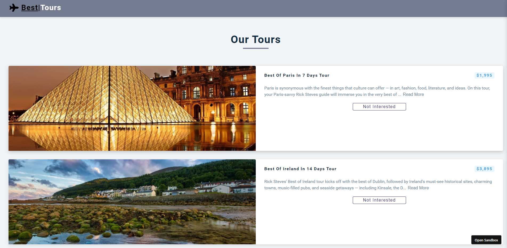

# Scrimba-React-app
Created with CodeSandbox

## Table of contents

- [Overview](#overview)
  - [The challenge](#the-challenge)
  - [Screenshot](#screenshot)
  - [Links](#links)
- [My process](#my-process)
  - [Built with](#built-with)
  - [Useful resources](#useful-resources)

## Overview
- Built a tour webpage with React and FreeCodeCamp

### The challenge

Users should be able to:

- View the tour listings for the BestTours tour company
- Press the read more to see more information on a listing
- Press the Not Interested button to remove the tour 

### Screenshot

### Links

- Solution URL: https://github.com/Jud1th1/Scrimba-React-app/
- Live Site URL: https://csb-7xlu83.netlify.app/

## My process
- Following along with the FreeCodeCamp React Projects tutorial I built a tours webpage app with React. It allows users to view a list of available tours and remove tours they are not interested in. The application fetches tour data from an API and dynamically renders the tours on the page.
**Setting up the project**
   - Initialized a new React project using Create React App in CodeSandBox.
   - Then I set up the basic project structure and component files.
**Fetching tour data**
   - Created a `fetchTours` function to fetch tour data from the API.
   - Implemented loading state management using the `useState` hook.
   - Used the `useEffect` hook to fetch the tours on component mount.
**Rendering tours**
   - Created a `Tours` component to render the list of tours.
(The challenge that I am still working on is below:)
   - Implementing the logic to sort tours based on likes. 
   - Added the ability to remove tours and toggle the like status.

### Built with

- HTML
- CSS
- Javascript
- React
- Desktop first workflow

### Useful resources
- https://www.youtube.com/watch?v=a_7Z7C_JCyo&t=1181s
